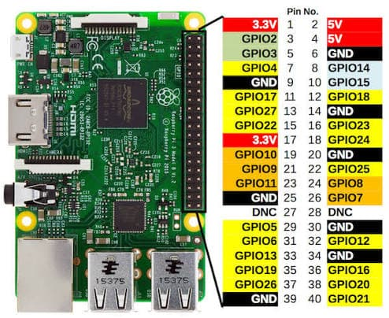

## Install

Run in raspberry console

```sh
  sudo apt-get install rpi.gpio
  python3 -m venv .venv
  source .venv/bin/activate
  pip3 install -r requirements.txt
```

## Set Up

Copy and paste _.env.example_, rename it with _.env_, and set the data required

## Run the project

`python3 main.py`

## Create systemctl service

Go to `/etc/systemd/system` and create a file `script.service` and write:

```
[Unit]
Description=Fan controller
After=network.target

[Service]
User=server
WorkingDirectory=/home/server/services/raspberry_controller
ExecStart=/home/server/services/raspberry_controller/.venv/bin/python main.py
Restart=always

[Install]
WantedBy=multi-user.target
```

then `sudo systemctl enable script` and `sudo systemctl start script`

## Features

- <b>Fan controller</b>

  Turn on the fan when the temperature is over MAX_TEMPETURE and turn it off when is under MIN_TEMPETURE (both configurable from .env file)

  This image is using BCM mode (not the one used in this script)
    

  To use the script, refer to the GPIO pinout diagram. For example, if PIN=7 is set in the .env file, connect your device to physical pin 7 on the Raspberry Pi, which corresponds to GPIO 4.
    